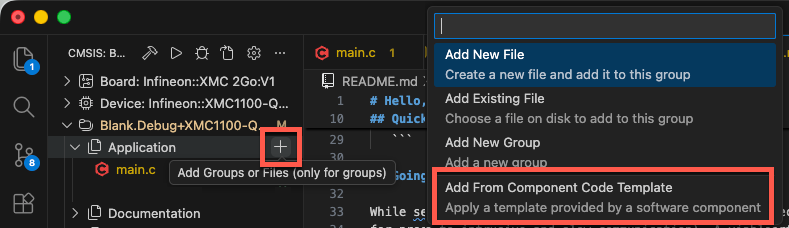

# Hello, World! (CMSIS Solution Example)

This is a minimal **Hello, World!** application for Arm Cortex-M devices using the **CMSIS Solution** project format.

This example demonstrates:
- A portable CMSIS-Core based application.
- Build, load, and debug using **Arm Keil Studio** for VS Code.
- Simple retargetable output (“Hello, World!”) via a [serial I/O message](https://github.com/Arm-Examples/.github/blob/main/profile/Serial.md) channel.

The project is intentionally simple and designed to scale: changing the [**board**](#change-target-hardware), [**serial I/O**](#serial-io-via-uart), [**RTOS**](#change-the-rtos)
, or [**debug adapter**](https://mdk-packs.github.io/vscode-cmsis-solution-docs/manage_settings.html) is straightforward using **Arm Keil Studio**.

## Current Setup

The setup in this repository is for the **[Infineon XMC2Go](https://www.keil.arm.com/boards/infineon-xmc-2go-v1-d3962c0/projects/)** development board using serial I/O via semihosting to a Telnet port. 
If you are using a different board refer to [Change Target Hardware](#change-target-hardware). 

> [!NOTE]
> STM32 boards use typically a STM32CubeMX based configuration with different startup code. Refer to an STM32 based example, i.e. [Hello_B-U585I-IOT02A](https://github.com/Arm-Examples/Hello_B-U585I-IOT02A).

## Quick Start

1. Install [Keil Studio for VS Code](https://marketplace.visualstudio.com/items?itemName=Arm.keil-studio-pack) from the
   VS Code marketplace.
2. [Clone this Git repository](https://vscode.dev/github.com/Arm-Examples/Hello_World) into a VS Code workspace.
3. The related tools and software packs are downloaded and installed. Review progress with
   *View - Output - CMSIS Solution*.
4. In the CMSIS view, use the
   [Action buttons](https://github.com/ARM-software/vscode-cmsis-csolution?tab=readme-ov-file#action-buttons) to build,
   load and debug the example on the hardware.
5. In the [VS Code Panel](https://code.visualstudio.com/api/ux-guidelines/panel), click on **SERIAL MONITOR**. Select
   the **Monitor Mode** "TCP" and set **Host** to `localhost` and **Port** to `4444`. Observe the output:

   ```txt
   SEGGER J-Link GDB Server V9.10 - Terminal output channel
   Hello, World!
   Hello, World!
   Hello, World!
   ...
   ```

[](https://vscode.dev/github.com/Arm-Examples/Hello_World)

## Change Target Hardware

This application is a generic CMSIS example that will run on any target hardware. If you want to change to another
development board/device, edit the following.

In the `Hello.csolution.yml` file, add the device's/board's CMSIS-Packs:

```yml
  packs:
    - pack: ARM::CMSIS
    - pack: Infineon::XMC1000_DFP # Change to the right CMSIS-Pack
```

Then, change the `target-type:/- type` to a new name and enter the correct `device:`/`board:` names:

```yml
  # List different hardware targets that are used to deploy the solution.
  target-types:
    - type: XMC1100-Q024x0064  # Change to a meaningful name
      target-set:
        - set:
          images:
            - project-context: Hello.Debug
          debugger:
            name: J-Link Server
            clock: 4000000
            protocol: swd
      device: XMC1100-Q024x0064  # Change to actual device
      board: XMC 2Go:V1          # Change to actual board
```

## Change the RTOS

This example is using the [CMSIS-RTOS v2 API](https://arm-software.github.io/CMSIS_6/latest/RTOS2/index.html) with
[CMSIS-FreeRTOS](https://arm-software.github.io/CMSIS-FreeRTOS/main/index.html) as the underlying real-time operating
system kernel. If you wish to change the kernel to
[Keil RTX5](https://arm-software.github.io/CMSIS-RTX/latest/index.html), do the following.

In the `Hello.cproject.yml` file, exchange:

```yml
    - component: CMSIS:RTOS2:FreeRTOS&Cortex-M
    - component: RTOS&FreeRTOS:Config&CMSIS RTOS2
    - component: RTOS&FreeRTOS:Core&Cortex-M
    - component: RTOS&FreeRTOS:Event Groups
    - component: RTOS&FreeRTOS:Timers
    - component: RTOS&FreeRTOS:Heap&Heap_4
```

with:

```yml
    - component: CMSIS:RTOS2:Keil RTX5&Source
```

In the same file, exchange the **ARM::CMSIS-FreeRTOS** pack with the **ARM::CMSIS-RTX** pack:

```yml
    - pack: ARM::CMSIS-RTX
```

## Serial I/O via UART

While semihosting requires not hardware configuration and can be easily used for quick debugging, it is not recommended
for production systems (due to intrusive and slow communication). A viable option is to use a UART (serial port)
instead. The following explains how to use the on-chip UART which is available through the Segger J-Link debug adapter
for `printf` output.

> [!CAUTION]
> The following is specific for the XMC2Go development board. If you have
> [changed the target hardware](#change-the-target-hardware), consult your board specific documentation to select the
> right software components and CMSIS-Packs.

### Adding Software Components

To be able to redirect the output to the UART, you need to add the following software components in the
`Hello.cproject.yml` file:

```yml
    - component: CMSIS-Compiler:CORE
    - component: CMSIS-Compiler:STDOUT:Custom
    - component: CMSIS Driver:USART
    - component: Device:RTE_Device
    - component: Device:XMClib:GPIO
    - component: Device:XMClib:SCU
    - component: Device:XMClib:UART
```

Also, add the **ARM::CMSIS-Compiler** pack to the list of `packs:` in the same file:

```yml
    - pack: ARM::CMSIS-Compiler
```

### Adding User Code

In the **CMSIS** view, click on the **+** sign next to **Application** and select **Add From Component Code Template**:



Then, select **CMSIS-Compiler:STDOUT:Custom** which adds a `stdout_user.c` file to the **Application** group. Add this
code in the file:

```c
#include "retarget_stdout.h"
#include "Driver_USART.h"

#include <stdint.h>

extern ARM_DRIVER_USART Driver_USART0;

static ARM_DRIVER_USART * const stdout_usart = &Driver_USART0;
static uint8_t stdout_usart_initialized;

#ifndef STDOUT_USART_BAUDRATE
#define STDOUT_USART_BAUDRATE 115200U
#endif

static int stdout_usart_ensure_initialized (void) {
  int32_t status;

  if (stdout_usart_initialized != 0U) {
    return 0;
  }

  status = stdout_usart->Initialize(NULL);
  if (status != ARM_DRIVER_OK) {
    return -1;
  }

  status = stdout_usart->PowerControl(ARM_POWER_FULL);
  if (status != ARM_DRIVER_OK) {
    return -1;
  }

  status = stdout_usart->Control(
    ARM_USART_MODE_ASYNCHRONOUS |
    ARM_USART_DATA_BITS_8       |
    ARM_USART_PARITY_NONE       |
    ARM_USART_STOP_BITS_1       |
    ARM_USART_FLOW_CONTROL_NONE,
    STDOUT_USART_BAUDRATE
  );
  if (status != ARM_DRIVER_OK) {
    return -1;
  }

  status = stdout_usart->Control(ARM_USART_CONTROL_TX, 1U);
  if (status != ARM_DRIVER_OK) {
    return -1;
  }

  stdout_usart_initialized = 1U;
  return 0;
}

/**
  Put a character to the stdout

  \param[in]   ch  Character to output
  \return          The character written, or -1 on write error.
*/
int stdout_putchar (int ch) {
  uint8_t c;

  if (stdout_usart_ensure_initialized() != 0) {
    return -1;
  }

  /* If caller prints bare '\n', emit CRLF on the wire. */
  if ((uint8_t)ch == (uint8_t)'\n') {
    (void)stdout_putchar('\r');
  }

  /* Serialize by waiting for any previous send to complete. */
  while (stdout_usart->GetStatus().tx_busy != 0U) {
  }

  c = (uint8_t)ch;
  if (stdout_usart->Send(&c, 1U) != ARM_DRIVER_OK) {
    return -1;
  }

  while (stdout_usart->GetStatus().tx_busy != 0U) {
  }

  return ch;
}
```

### Device Configuration

The UART that is connected to the Segger J-Link uses the the ports **P2.1** and **P2.2** on the device. You need to
configure this in the `RTE_Device.h` file.

- In the **CMSIS** view, expand **Device_RTE_Device** and click on the `RTE_Device.h` file. This file is annotated for
  **Configuration Wizard view** which can be enabled by pressing the
   button at the top right corner.
- In this view, enable `UART0` and set the `UART0_TX_Pin` to `P2_1` and the `UART0_RX_Pin` to `P2_2`.
- Save the file.

### Build and Run

If you now build the application and run it on the target, you need to change the **SERIAL MONITOR** to the following:

- **Monitor Mode**: Serial
- **Port**: the Segger J-Link
- **Baud rate**: 115200

Press **Start Monitoring** to view the `printf` massages.

## More Examples

Similar examples which are pre-configured for the UART output are available on GitHub:

- [Hello_B-U585I-IOT02A](https://github.com/Arm-Examples/Hello_B-U585I-IOT02A)
- [Hello_NUCLEO-G474RE](https://github.com/Arm-Examples/Hello_NUCLEO-G474RE)
- [Hello_NUCLEO-F756ZG](https://github.com/Arm-Examples/Hello_NUCLEO-F756ZG)
- [Hello_LPCXpresso55S69](https://github.com/orgs/Arm-Examples/repositories?q=hello#:~:text=Hello_LPCXpresso55S69)
- [Hello_FRDM-K32L3A6](https://github.com/Arm-Examples/Hello_FRDM-K32L3A6)
